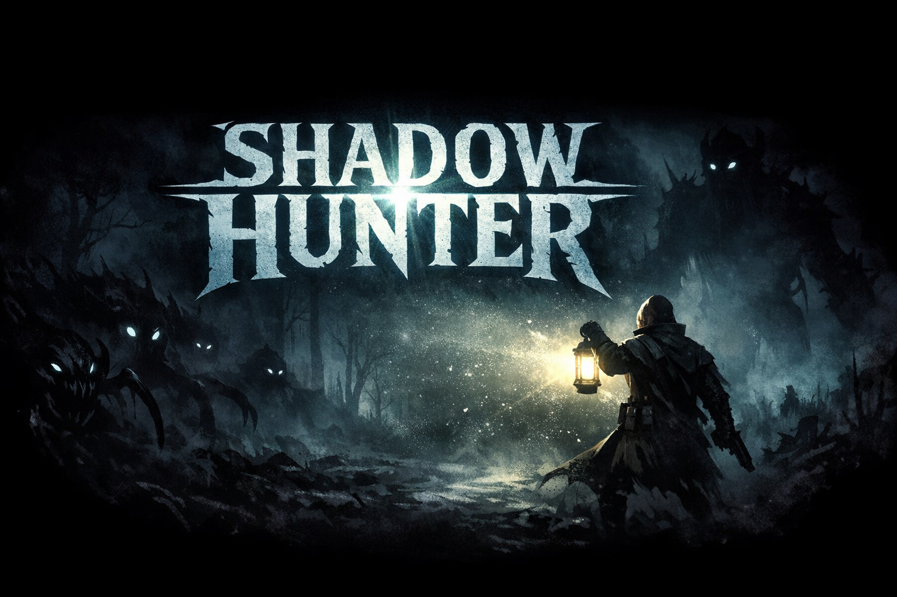

# Shadow Hunter

  

  
  
  

Shadow Hunter is a top-down roguelite shooter built in **Godot 4.2**.

The player explores dark environments while carrying a lantern that reveals enemies hiding in the darkness. Survival depends on positioning, light management, and combat efficiency.

The game blends ideas from **Vampire Survivors**, **Darkwood**, and **Hotline Miami**, with a central mechanic built around **light versus darkness**.

---

# Core Concept

The world of Shadow Hunter is almost completely dark.

The player carries a lantern that creates a circular **light radius**. Enemies exist in the darkness and only become visible once they enter the player's light.

This creates constant tension where danger can emerge from any direction.

Core mechanics:

- Light reveals enemies
- Darkness hides threats
- Positioning is critical
- Survive waves of enemies
- Level up and choose upgrades

---

# Gameplay Loop

1. Enter a dark level
2. Enemies spawn in the darkness
3. Fight enemies using light-based weapons
4. Collect Light Shards (experience)
5. Level up and select upgrades
6. Survive increasing enemy waves
7. Defeat bosses
8. Continue to the next level

Typical run duration: **10–15 minutes**

---

# Features

## Dynamic Light System

The player's lantern controls what is visible in the world.

Enemies outside the light remain hidden.

Possible upgrades:

- Increased light radius
- Directed spotlight
- Pulsing light bursts
- Orbiting lights

---

## Combat

Combat is fast and reactive.

Weapons are based on light energy instead of traditional firearms.

Examples:

- Light Beam
- Flares
- UV Pulse
- Light Turrets

---

## Enemy Types

Enemies emerge from the darkness and behave differently depending on type.

Examples:

- Shadow Crawlers
- Lurkers
- Swarm Wisps
- Light Eaters
- Rift Spiders

---

## Boss Encounters

Bosses manipulate darkness and alter the battlefield.

Examples:

- Devourer
- Lantern Breaker
- Swarm Mother
- Shadow Titan

---

# Screenshots
<!--

  
  

-->
---

# Technology

Engine: **Godot 4.2**  
Language: **GDScript**  
Graphics: **AI-assisted asset generation**

Visual style:

- dark fantasy
- silhouette enemies
- glow effects
- minimal textures

---

# Project Structure
